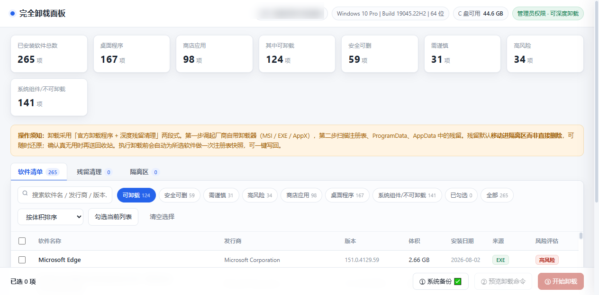

# 完全卸载面板（Windows）

[](#兼容性)
[-success)](#快速开始)
[](LICENSE)

扫描电脑上**全部**已安装软件（注册表卸载项 + 商店应用），标注风险等级，然后用「官方卸载程序 + 深度残留清理」两段式把它们**卸干净**：注册表、ProgramData、AppData 缓存、开始菜单/桌面快捷方式一并处理——全程可逆、全程留日志。



## 为什么是它

| 常规卸载 | 本工具 |
|---|---|
| 调用卸载器后留下大量注册表与 AppData 残留 | 官方卸载后**主动扫描残留**，逐项标注可信度后清理 |
| 不知道哪些能删、删了会出事 | 每个软件标注**安全 / 需谨慎 / 高风险**及中文原因；疑似属于其他软件的残留自动降级且默认不勾选 |
| 删了就没了，出事无法回头 | **系统还原点 + 注册表快照 + 残留先隔离不删除 + 最终送回收站**，四道可逆护栏 |

## 快速开始（便携版 · 推荐）

1. 下载 `portable/UninstallPanel.ps1` 和 `portable/启动面板.bat`，放**同一个目录**
2. 双击 **`启动面板.bat`** → 自动请求管理员权限 → 浏览器自动打开面板
3. 用完关闭那个黑窗口即停止面板

```bat
powershell -NoProfile -ExecutionPolicy Bypass -File .\UninstallPanel.ps1
```

> 便携版是**单个 `.ps1` 文件**（界面已内嵌），只用 Windows 自带的 PowerShell，**零外部依赖**，U 盘拷走即可在任意 Windows 电脑使用。

### 参数

| 参数 | 说明 |
|---|---|
| `-Port 8800` | 指定端口（默认 8791，被占用自动后移） |
| `-WorkDir D:\panel` | 指定数据目录（默认 `%LOCALAPPDATA%\UninstallPanel`） |
| `-NoBrowser` | 不自动打开浏览器 |
| `-NoElevate` | 不尝试提权 |
| `-SelfTest` | 自检：全链路验证，引擎强制降级为演练（dry-run），**物理上不可能执行真实卸载** |

## 工作流程

```
① 扫描清单 ──► ② 勾选软件 ──► ③ 预览确切命令(可改写) ──► ④ 系统备份
                                                              │
        ⑦ 隔离区(可还原/送回收站) ◄── ⑥ 残留扫描 ◄── ⑤ 官方卸载
```

- **卸载方式自动识别**：MSI → `msiexec /x /qn`；EXE → 厂商静默参数（Inno `/VERYSILENT`、NSIS `/S` 等）；商店应用 → `Remove-AppxPackage`；也可切换成弹出厂商向导的交互模式
- **残留扫描**：Program Files / ProgramData / AppData / 注册表候选残留，逐项标注可信度（高/中/低），低可信项默认不勾选
- **隔离区**：残留是**移动**进隔离区而非删除；注册表项先落 JSON 快照再删，可一键写回；确认无用后送回收站（回收站里仍可恢复）

## 安全模型（四道护栏）

1. **预览**：执行前展示每一条确切命令行，可逐条改写
2. **备份**：创建系统还原点 + 注册表卸载项快照（系统保护未开启时自动开启 C 盘保护）
3. **二次确认**：必须手工输入"确认卸载"；未备份不允许卸载；单批上限 10 项
4. **可逆**：隔离区按批次还原文件、写回注册表快照；最终处置只送回收站

## 仓库结构

```
├── portable/
│   ├── UninstallPanel.ps1        # 便携版：引擎 + 界面 单文件（由 src/ 组装生成）
│   ├── 启动面板.bat               # 双击启动（自动提权 + 打开浏览器）
│   ├── 使用说明.md                # 详细使用文档
│   ├── build.py                  # 组装脚本：src/ 分片 + 界面 → 单文件
│   └── src/                      # 引擎源码分片
│       ├── p1_scan_engine.ps1    #   软件扫描（注册表 + AppX）与风险评级
│       ├── p2_uninstall_job.ps1  #   卸载作业流水线
│       ├── p3_backup_cleanup.ps1 #   备份/注册表快照/残留隔离与还原
│       └── p4_http_server.ps1    #   本地 HTTP 服务 + 界面内嵌 + 自检
├── uninstall-panel/              # Python 版（功能相同，需 Python 3）
│   ├── server.py
│   ├── index.html
│   └── start-panel.bat
└── docs/
    └── screenshot.png
```

改动源码后重新生成单文件：

```bash
cd portable && python build.py
```

## 兼容性

- **Windows 10 / 11**：全部功能（含商店应用 AppX 清理）
- **Windows 7 SP1 / 8.1**：桌面程序全部可用，商店应用部分自动跳过
- 需要管理员权限（脚本会自行请求提权）
- Python 版需要 Python 3.8+（仅标准库）

## 免责声明

本工具会调用各软件自带的卸载程序，并清理注册表与磁盘残留。虽然全流程设计为可逆，仍请**先备份重要数据**。使用风险由使用者自行承担。

## License

[MIT](LICENSE)
